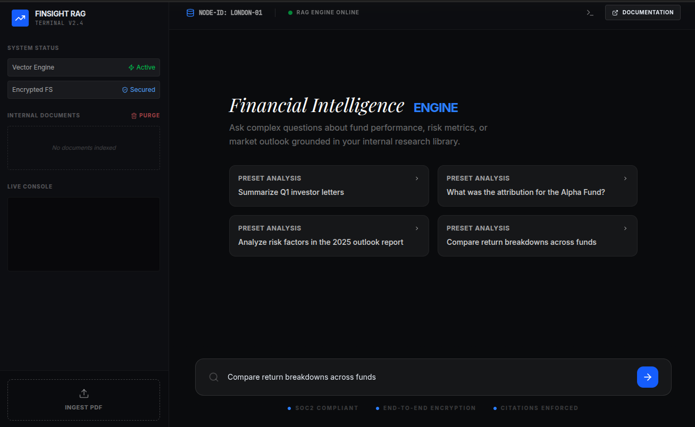

# FinSight RAG Platform

FinSight is a production-grade Retrieval-Augmented Generation (RAG) platform designed specifically for the financial services industry. It enables analysts and clients to interact with complex internal documents—such as investor letters, fund reports, and research materials—through a secure, high-accuracy AI interface.

## 🚀 Key Features

- **Intelligent PDF Ingestion**: Extracts structured text from multi-column financial PDFs while preserving metadata (source, page number).
- **Client-Side Vector Engine**: Utilizes Gemini 2.0 Embeddings for fast, semantic search processed directly in the secure environment.
- **Citation-Grounded Intelligence**: Powered by Gemini 3 Flash, the system provides answers strictly based on retrieved context with explicit source citations.
- **Zero-Trust Resilience**: Implements hallucination mitigation by enforcing strict grounding rules in the RAG pipeline.
- **Financial-Grade UI**: A high-density, "terminal-inspired" interface built for professional analysts, featuring live processing logs and reliability metrics.
- **Persistent Local Index**: Uses IndexedDB for secure, local storage of vector embeddings and document chunks.

## 🛠️ Technical Stack

- **Frontend**: React 19, TypeScript, Tailwind CSS 4, Framer Motion
- **AI/LLM**: Google Gemini API (`gemini-3-flash-preview`), Gemini Embeddings (`gemini-embedding-2-preview`)
- **PDF Processing**: PDF.js (for high-fidelity structure extraction)
- **Vector Database**: Client-side IndexedDB with custom Cosine Similarity implementation
- **Icons**: Lucide React

## 📖 Architecture Overview

1. **Ingestion**: PDFs are parsed client-side. Text is cleaned and chunked using intelligent overlap strategies.
2. **Embedding**: Each chunk is converted into a 768-dimensional vector via the Gemini Embedding model.
3. **Storage**: Vectors and metadata are stored locally for fast retrieval without persistent server overhead.
4. **Retrieval**: User queries are vectorized and compared against the local index using high-performance similarity calculations.
5. **Augmentation**: Top relevant chunks are injected into a specialized financial system prompt.
6. **Generation**: The LLM generates a response with inline citations, ensuring complete transparency.

## 🔒 Security & Compliance

- **Private Processing**: Document extraction and vector indexing occur within the application context.
- **Provider Abstraction**: Ready for multi-model deployments (Anthropic/OpenAI) via clean service interfaces.
- **Groundedness**: System-level instructions prevent the model from using external "knowledge" for financial advice, reducing risk.

## 🚦 Getting Started

1. Set up your `GEMINI_API_KEY` in the secrets panel.
2. Launch the app and use the **"Ingest PDF"** action in the sidebar.
3. Once indexed, start querying your internal library via the command bar.

---

*Built with precision for the future of financial intelligence.*
